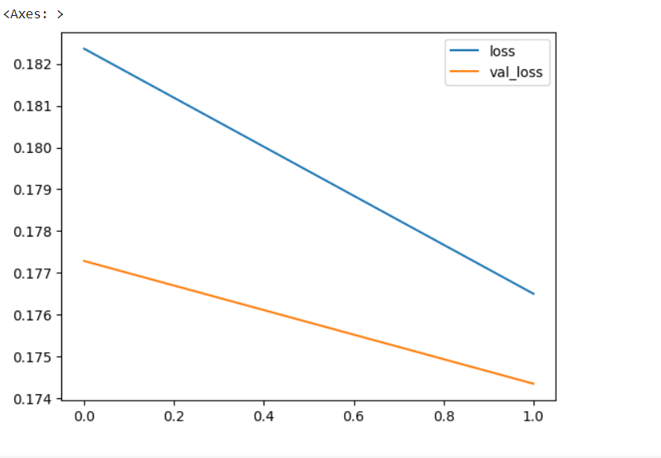

# Convolutional Autoencoder for Image Denoising

## AIM

To develop a convolutional autoencoder for image denoising application.

## Problem Statement and Dataset
In this experiment, we use an autoencoder to process handwritten digit images from the MNIST dataset. The autoencoder learns to encode and decode the images, reducing noise through layers like MaxPooling and convolutional. Then, we repurpose the encoded data to build a convolutional neural network for classifying digits into numerical values from 0 to 9. The goal is to create an accurate classifier for handwritten digits removing noise.


## Convolution Autoencoder Network Model


## DESIGN STEPS

## STEP 1:
Import TensorFlow, Keras, NumPy, Matplotlib, and Pandas.

## STEP 2:
Load MNIST dataset, normalize pixel values, add Gaussian noise, and clip values.

## STEP 3:
Plot a subset of noisy test images.

## STEP 4:
Define encoder and decoder architecture using convolutional and upsampling layers.

## STEP 5:
Compile the autoencoder model with optimizer and loss function.

## STEP 6:
Train the autoencoder model with specified parameters and validation data.

## STEP 7:
Plot training and validation loss curves.

## STEP 8:
Use the trained model to reconstruct images and visualize original, noisy, and reconstructed images.

## PROGRAM
### Name: KARTHICK K
### Register Number: 212222040070
```python
from tensorflow import keras
from tensorflow.keras import layers
from tensorflow.keras import utils
from tensorflow.keras import models
from tensorflow.keras.datasets import mnist
import numpy as np
import matplotlib.pyplot as plt
(x_train, _), (x_test, _) = mnist.load_data()
x_train.shape
x_train_scaled = x_train.astype('float32') / 255.
x_test_scaled = x_test.astype('float32') / 255.
x_train_scaled = np.reshape(x_train_scaled, (len(x_train_scaled), 28, 28, 1))
x_test_scaled = np.reshape(x_test_scaled, (len(x_test_scaled), 28, 28, 1))
noise_factor = 0.5
x_train_noisy = x_train_scaled + noise_factor * np.random.normal(loc=0.0, scale=1.0, size=x_train_scaled.shape) 
x_test_noisy = x_test_scaled + noise_factor * np.random.normal(loc=0.0, scale=1.0, size=x_test_scaled.shape) 

x_train_noisy = np.clip(x_train_noisy, 0., 1.)
x_test_noisy = np.clip(x_test_noisy, 0., 1.)
n = 10
plt.figure(figsize=(20, 2))
for i in range(1, n + 1):
    ax = plt.subplot(1, n, i)
    plt.imshow(x_test_noisy[i].reshape(28, 28))
    plt.gray()
    ax.get_xaxis().set_visible(False)
    ax.get_yaxis().set_visible(False)
plt.show()


# Input layer (28x28x1 for grayscale images)
input_img = keras.Input(shape=(28, 28, 1))

# Encoder
x = layers.Conv2D(16, (3, 3), activation='relu', padding='same')(input_img)  # (28, 28, 16)
x = layers.MaxPooling2D((2, 2), padding='same')(x)  # (14, 14, 16)
x = layers.Conv2D(8, (3, 3), activation='relu', padding='same')(x)  # (14, 14, 8)
encoded = layers.MaxPooling2D((2, 2), padding='same')(x)  # (7, 7, 8)

# Encoder output dimension is (7, 7, 8)

# Decoder
x = layers.Conv2D(8, (3, 3), activation='relu', padding='same')(encoded)  # (7, 7, 8)
x = layers.UpSampling2D((2, 2))(x)  # (14, 14, 8)
x = layers.Conv2D(16, (3, 3), activation='relu', padding='same')(x)  # (14, 14, 16)
x = layers.UpSampling2D((2, 2))(x)  # (28, 28, 16)
decoded = layers.Conv2D(1, (3, 3), activation='sigmoid', padding='same')(x)  # (28, 28, 1)

# Autoencoder model
autoencoder = keras.Model(input_img, decoded)

# Summary of the model architecture
autoencoder.summary()
print('Name: KARTHICK K    Register Number: 212222040070')
autoencoder.summary()
autoencoder.compile(optimizer='adam', loss='binary_crossentropy')
autoencoder.fit(x_train_noisy, x_train_scaled,
                epochs=2,
                batch_size=128,
                shuffle=True,
                validation_data=(x_test_noisy, x_test_scaled))
decoded_imgs = autoencoder.predict(x_test_noisy)
history=autoencoder.fit(x_train_noisy, x_train_scaled,
                epochs=2,
                batch_size=128,
                shuffle=True,
                validation_data=(x_test_noisy, x_test_scaled))
decoded_imgs = autoencoder.predict(x_test_noisy)

n = 10
print('Name: KARTHICK K    Register Number: 212222040070')
plt.figure(figsize=(20, 4))
for i in range(1, n + 1):
    # Display original
    ax = plt.subplot(3, n, i)
    plt.imshow(x_test_scaled[i].reshape(28, 28))
    plt.gray()
    ax.get_xaxis().set_visible(False)
    ax.get_yaxis().set_visible(False)

    # Display noisy
    ax = plt.subplot(3, n, i+n)
    plt.imshow(x_test_noisy[i].reshape(28, 28))
    plt.gray()
    ax.get_xaxis().set_visible(False)
    ax.get_yaxis().set_visible(False)    

    # Display reconstruction
    ax = plt.subplot(3, n, i + 2*n)
    plt.imshow(decoded_imgs[i].reshape(28, 28))
    plt.gray()
    ax.get_xaxis().set_visible(False)
    ax.get_yaxis().set_visible(False)
plt.show()

print(''Name: KARTHICK K    Register Number: 212222040070'')
plt.plot(history.history['loss'], label='Training Loss')
plt.plot(history.history['val_loss'], label='Validation Loss')
plt.title('Training and Validation Loss vs Iterations')
plt.xlabel('Epochs')
plt.ylabel('Loss')
plt.legend()
plt.grid(True)
plt.show()
```

## OUTPUT

### Training Loss, Validation Loss Vs Iteration Plot


### Original vs Noisy Vs Reconstructed Image



## RESULT
Thus, the convolutional autoencoder for image denoising application has been successfully developed.